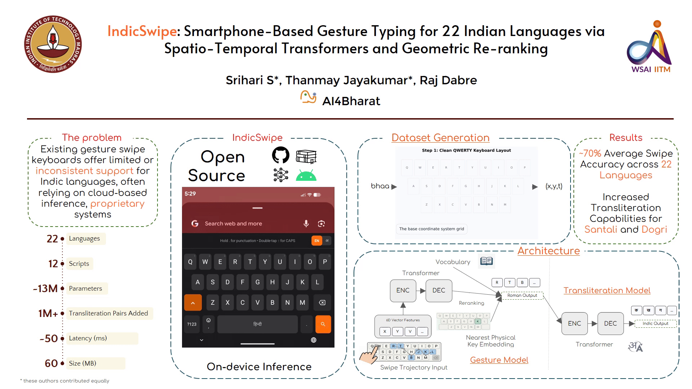

# 🖊️ IndicSwipe v2

> A state-of-the-art gesture typing (Swipe-to-Type) app tailored for Indian languages. IndicSwipe combines a deep character-level Transformer gesture decoder with n-gram language models running on-device for fast, accurate, and fluid typing across 22+ Indian languages and romanized dialects (Hinglish, Tanglish, etc.).

[](https://play.google.com/store/apps/details?id=com.indicswipe.ai4bharat)

---

## 📺 Overview & Demo



---

## 🌐 Supported Languages & Downloads

IndicSwipe supports 22 scheduled languages of India and their corresponding keyboard layouts, along with their romanized variants. You can download the pre-trained models and dataset packages directly from the table below:

| Language | Script / ISO Code | Accent Color | Transliteration | Swipe Decoding |
| :--- | :--- | :--- | :---: | :---: |
| **Hindi** | `__hi__` / हिन्दी |  | [📥 Download](https://objectstore.e2enetworks.net/swipe-indic/xlit/hindi.zip) | [📥 Download](https://objectstore.e2enetworks.net/swipe-indic/hindi.zip) |
| **Bengali** | `__bn__` / বাংলা |  | [📥 Download](https://objectstore.e2enetworks.net/swipe-indic/xlit/bengali.zip) | [📥 Download](https://objectstore.e2enetworks.net/swipe-indic/bengali.zip) |
| **Tamil** | `__ta__` / தமிழ் |  | [📥 Download](https://objectstore.e2enetworks.net/swipe-indic/xlit/tamil.zip) | [📥 Download](https://objectstore.e2enetworks.net/swipe-indic/tamil.zip) |
| **Telugu** | `__te__` / తెలుగు |  | [📥 Download](https://objectstore.e2enetworks.net/swipe-indic/xlit/telugu.zip) | [📥 Download](https://objectstore.e2enetworks.net/swipe-indic/telugu.zip) |
| **Marathi** | `__mr__` / मराठी |  | [📥 Download](https://objectstore.e2enetworks.net/swipe-indic/xlit/marathi.zip) | [📥 Download](https://objectstore.e2enetworks.net/swipe-indic/marathi.zip) |
| **Kannada** | `__kn__` / ಕನ್ನಡ |  | [📥 Download](https://objectstore.e2enetworks.net/swipe-indic/xlit/kannada.zip) | [📥 Download](https://objectstore.e2enetworks.net/swipe-indic/kannada.zip) |
| **Gujarati** | `__gu__` / ગુજરાતી |  | [📥 Download](https://objectstore.e2enetworks.net/swipe-indic/xlit/gujarati.zip) | [📥 Download](https://objectstore.e2enetworks.net/swipe-indic/gujarati.zip) |
| **Punjabi** | `__pa__` / ਪੰਜਾਬੀ |  | [📥 Download](https://objectstore.e2enetworks.net/swipe-indic/xlit/punjabi.zip) | [📥 Download](https://objectstore.e2enetworks.net/swipe-indic/punjabi.zip) |
| **Malayalam** | `__ml__` / മലയാളം |  | [📥 Download](https://objectstore.e2enetworks.net/swipe-indic/xlit/malayalam.zip) | [📥 Download](https://objectstore.e2enetworks.net/swipe-indic/malayalam.zip) |
| **Odia** | `__or__` / ଓଡ଼ିଆ |  | [📥 Download](https://objectstore.e2enetworks.net/swipe-indic/xlit/odia.zip) | [📥 Download](https://objectstore.e2enetworks.net/swipe-indic/odia.zip) |
| **Assamese** | `__as__` / অসমীয়া |  | [📥 Download](https://objectstore.e2enetworks.net/swipe-indic/xlit/assamese.zip) | [📥 Download](https://objectstore.e2enetworks.net/swipe-indic/assamese.zip) |
| **Maithili** | `__mai__` / मैथिली |  | [📥 Download](https://objectstore.e2enetworks.net/swipe-indic/xlit/maithili.zip) | [📥 Download](https://objectstore.e2enetworks.net/swipe-indic/maithili.zip) |
| **Sanskrit** | `__sa__` / संस्कृतम् |  | [📥 Download](https://objectstore.e2enetworks.net/swipe-indic/xlit/sanskrit.zip) | [📥 Download](https://objectstore.e2enetworks.net/swipe-indic/sanskrit.zip) |
| **Urdu** | `__ur__` / اردو |  | [📥 Download](https://objectstore.e2enetworks.net/swipe-indic/xlit/urdu.zip) | [📥 Download](https://objectstore.e2enetworks.net/swipe-indic/urdu.zip) |
| **Kashmiri** | `__ks__` / کٲشُر |  | [📥 Download](https://objectstore.e2enetworks.net/swipe-indic/xlit/kashmiri.zip) | [📥 Download](https://objectstore.e2enetworks.net/swipe-indic/kashmiri.zip) |
| **Nepali** | `__ne__` / नेपाली |  | [📥 Download](https://objectstore.e2enetworks.net/swipe-indic/xlit/nepali.zip) | [📥 Download](https://objectstore.e2enetworks.net/swipe-indic/nepali.zip) |
| **Sindhi (Arabic)** | `__sd__` / سنڌي |  | [📥 Download](https://objectstore.e2enetworks.net/swipe-indic/xlit/sindhi_arab.zip) | [📥 Download](https://objectstore.e2enetworks.net/swipe-indic/sindhi_arab.zip) |
| **Sindhi (Devanagari)** | `__sdd__` / सिंधी |  | [📥 Download](https://objectstore.e2enetworks.net/swipe-indic/xlit/sindhi_dev.zip) | [📥 Download](https://objectstore.e2enetworks.net/swipe-indic/sindhi_dev.zip) |
| **Konkani** | `__gom__` / कोंकणी |  | [📥 Download](https://objectstore.e2enetworks.net/swipe-indic/xlit/konkani.zip) | [📥 Download](https://objectstore.e2enetworks.net/swipe-indic/konkani.zip) |
| **Manipuri** | `__mni__` / ꯃꯩꯇꯩꯂꯣꯟ |  | [📥 Download](https://objectstore.e2enetworks.net/swipe-indic/xlit/manipuri.zip) | [📥 Download](https://objectstore.e2enetworks.net/swipe-indic/manipuri.zip) |
| **Bodo** | `__brx__` / बड़ो |  | [📥 Download](https://objectstore.e2enetworks.net/swipe-indic/xlit/bodo.zip) | [📥 Download](https://objectstore.e2enetworks.net/swipe-indic/bodo.zip) |
| **Dogri** | `__doi__` / डोगरी |  | [📥 Download](https://objectstore.e2enetworks.net/swipe-indic/xlit/dogri.zip) | [📥 Download](https://objectstore.e2enetworks.net/swipe-indic/dogri.zip) |
| **Santali** | `__sat__` / ᱥᱟᱱᱛᱟᱲᱤ |  | [📥 Download](https://objectstore.e2enetworks.net/swipe-indic/xlit/santali.zip) | [📥 Download](https://objectstore.e2enetworks.net/swipe-indic/santali.zip) |
---

## 🛠️ Model Training & Pipeline

The pipeline is split into modular scripts located in the `training/` directory.

### Step 1: Generate Gesture Datasets
Generate synthetic swipe trajectory datasets based on keyboard geometry and target lexicons.
```bash
python training/01_generate_dataset.py --lang marathi --output training/data/marathi_train.jsonl
```

### Step 2: Train the Transformer Model
Train the `CharacterLevelSwipeModel` with standard trajectory features (normalized coordinates, velocity, acceleration, nearest key embeddings) and character tokenizer.
```bash
python training/02_train_model.py \
    --lang marathi \
    --train_path training/data/marathi_train.jsonl \
    --val_path training/data/marathi_val.jsonl \
    --checkpoint_dir checkpoints/marathi/
```

### Step 3: Export PyTorch to ONNX
Compile the PyTorch model encoder and decoder to standard ONNX with dynamic shapes.
```bash
python training/03_export_onnx.py \
    --checkpoint checkpoints/marathi/best_model.pt \
    --out_dir android_ready/marathi/
```

### Step 4: Graph Optimization
Perform ONNX constant folding, dead-node elimination, and sequence fusing.
```bash
python training/04_optimize_onnx.py \
    --model_dir android_ready/marathi/
```

### Step 5: Post-Training Quantization
Quantize the weights to 8-bit integers (INT8) to reduce model size by 4x with negligible accuracy drop.
```bash
python training/05_quantize_onnx.py \
    --model_dir android_ready/marathi/
```

---

## 📱 Android App Integration

The Android Keyboard App located in [indic_swipe_android_studio_bundle_1](file:///c:/Users/Thanmay/Downloads/Indic-Swipe-v2/indic_swipe_android_studio_bundle_1) features:
- **ONNX Runtime Mobile**: Integrated local inference using `ONNXRuntime` to execute the gesture decoder.
- **KenLM JNI**: Custom C++ bindings compiled using NDK (`kenlm-jni`) to perform blazing-fast N-Gram language model language scoring on the decoder's beam outputs.
- **Swipe Trail Renderer**: Premium visual physics-based smooth finger trails (`SwipeView.kt`).

To run the Android App:
1. Open the [indic_swipe_android_studio_bundle_1](file:///c:/Users/Thanmay/Downloads/Indic-Swipe-v2/indic_swipe_android_studio_bundle_1) directory in Android Studio.
2. Build the C++ JNI libraries using NDK CMake.
3. Place your optimized models (`swipe_model_character_quant.onnx` and language files) in the `app/src/main/assets` directory.
4. Build and run on an Android Device/Emulator!

---

## 👥 Contributors

- **Srihari S**
- **Thanmay Jayakumar**
- **Raj Dabre**

---

## 🤝 Acknowledgements

We would like to express our gratitude to the following individuals for their support (listed in alphabetical order):
- **Deepon Halder**
- **Kaushal Bhogale**
- **Krishna Jeena**
- **Mohammed Safi Ur Rahman Khan**
- **Pranjal Chitale**
- **Sidharth Pulipaka**
- **Tahir Javed**
- **Vignesh Selvaraj**
---

## 📚 References

1. **IndicSwipe**: 
   - *Paper*: "Joint Transformer/RNN Architecture for Gesture Typing in Indic Languages" (COLING 2020)
   - *Repository*: [AI4Bharat/Indic-Swipe](https://github.com/AI4Bharat/Indic-Swipe)
2. **Aksharantar**:
   - *Paper*: "Aksharantar: Towards Building Open Transliteration Tools for the Next Billion Users" (EMNLP 2023)
   - *Repository*: [AI4Bharat/IndicXlit](https://github.com/AI4Bharat/IndicXlit)
   - *Dataset*: [ai4bharat/Aksharantar on Hugging Face](https://huggingface.co/datasets/ai4bharat/Aksharantar)
3. **CleverKeys**: 
   - *Repository*: [tribixbite/CleverKeys](https://github.com/tribixbite/CleverKeys)
4. **Google Keyboard (Gboard) Gesture Typing**:
   - *Paper*: "Long Short Term Memory Neural Network for Keyboard Gesture Decoding" (Google Research)
   - *Link*: [Google Research Publication PDF](https://research.google/pubs/long-short-term-memory-neural-network-for-keyboard-gesture-recognition/)
5. **Google Keyboard Blog**:
   - *Blog Post*: "The Machine Intelligence Behind Gboard"
   - *Link*: [Google Research Blog](https://research.google/blog/the-machine-intelligence-behind-gboard/)

---

## 📝 License

This project is licensed under the MIT License - see the [LICENSE](LICENSE) file for details.
